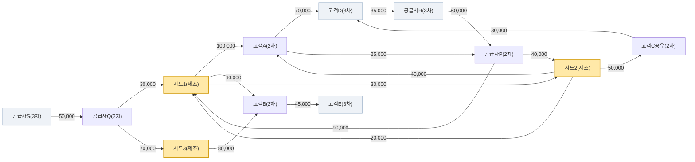
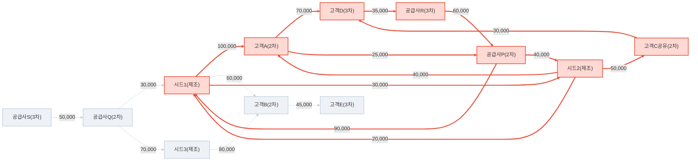

# 외생충격 시나리오 테스트셋 — 3시드 · depth-3 · 12노드

> 사람이 직접 편집/재테스트 가능한 합성 그래프. edges 는 저장방향(셀러 from -> 바이어 to, 금액 amount). 시드 관점에서 from=셀러면 그 시드의 매출, to=바이어면 매입. 실제 거래망처럼 양방향 거래(시드1<->시드2)와 순환(3-순환 시드1->고객A->공급사P->시드1, 5-순환 고객D->공급사R->공급사P->시드1->고객A->고객D)을 포함 → damping<1 로 절대수렴.

> 엔진: 실제 `run_tariff_shock` / `run_transaction_change` (DB 대신 합성 그래프 주입). 모든 계산(정규화·방향·감쇠·오버라이드·Δ)은 운영 코드 그대로.

## 1. 테스트 그래프 구조 (12노드)

- 시드(1차) 3곳 + depth-3 연결 노드 = 총 12노드, 18엣지. `edge_direction`: from = 셀러(공급), to = 바이어(구매). amount = 공급가액(원).

### 그래프 다이어그램 (방향성 엣지 + 거래금액)

_노드 색: 노란=시드(1차), 회색=3차. 화살표=셀러→바이어, 라벨=거래금액(원). (총 12노드)_

### 순환 경로 강조 다이어그램

단순순환 **11개** 탐지. 빨강 굵은 화살표=순환 참여 거래, 회색 점선=비순환(피드포워드).

**탐지된 순환 경로** (짧은 순)

- (2-순환) 시드1(제조) → 시드2(제조) → 시드1(제조)
- (3-순환) 공급사P(2차) → 시드1(제조) → 고객A(2차) → 공급사P(2차)
- (3-순환) 공급사P(2차) → 시드2(제조) → 고객A(2차) → 공급사P(2차)
- (4-순환) 공급사P(2차) → 시드1(제조) → 시드2(제조) → 고객A(2차) → 공급사P(2차)
- (4-순환) 공급사P(2차) → 시드2(제조) → 시드1(제조) → 고객A(2차) → 공급사P(2차)
- (5-순환) 공급사P(2차) → 시드1(제조) → 고객A(2차) → 고객D(3차) → 공급사R(3차) → 공급사P(2차)
- (5-순환) 공급사P(2차) → 시드2(제조) → 고객A(2차) → 고객D(3차) → 공급사R(3차) → 공급사P(2차)
- (5-순환) 공급사P(2차) → 시드2(제조) → 고객C공유(2차) → 고객D(3차) → 공급사R(3차) → 공급사P(2차)
- (6-순환) 공급사P(2차) → 시드1(제조) → 시드2(제조) → 고객A(2차) → 고객D(3차) → 공급사R(3차) → 공급사P(2차)
- (6-순환) 공급사P(2차) → 시드1(제조) → 시드2(제조) → 고객C공유(2차) → 고객D(3차) → 공급사R(3차) → 공급사P(2차)
- (6-순환) 공급사P(2차) → 시드2(제조) → 시드1(제조) → 고객A(2차) → 고객D(3차) → 공급사R(3차) → 공급사P(2차)

### 노드

| bizno | 기업명 | tier | 시드 |
|---|---|---|---|
| 1000000001 | 시드1(제조) | 1차 | ✅ |
| 1000000002 | 시드2(제조) | 1차 | ✅ |
| 1000000003 | 시드3(제조) | 1차 | ✅ |
| 2000000001 | 고객A(2차) | 2차 |  |
| 2000000002 | 고객B(2차) | 2차 |  |
| 2000000003 | 고객C공유(2차) | 2차 |  |
| 2000000004 | 공급사P(2차) | 2차 |  |
| 2000000005 | 공급사Q(2차) | 2차 |  |
| 3000000001 | 고객D(3차) | 3차 |  |
| 3000000002 | 고객E(3차) | 3차 |  |
| 3000000003 | 공급사R(3차) | 3차 |  |
| 3000000004 | 공급사S(3차) | 3차 |  |

### 엣지 (셀러→바이어, 금액)

| 셀러(from) | 바이어(to) | 금액(원) | 설명 |
|---|---|---|---|
| 시드1(제조) | 고객A(2차) | 100,000 | 시드1 매출→고객A |
| 시드1(제조) | 고객B(2차) | 60,000 | 시드1 매출→고객B |
| 시드2(제조) | 고객A(2차) | 40,000 | 시드2 매출→고객A |
| 시드2(제조) | 고객C공유(2차) | 50,000 | 시드2 매출→고객C |
| 시드3(제조) | 고객B(2차) | 80,000 | 시드3 매출→고객B |
| 고객A(2차) | 고객D(3차) | 70,000 | 고객A 매출→고객D(2→3차) |
| 고객B(2차) | 고객E(3차) | 45,000 | 고객B 매출→고객E(2→3차) |
| 고객C공유(2차) | 고객D(3차) | 30,000 | 고객C 매출→고객D(2→3차) |
| 공급사P(2차) | 시드1(제조) | 90,000 | 공급사P 매출→시드1 (시드1 매입) |
| 공급사Q(2차) | 시드1(제조) | 30,000 | 공급사Q 매출→시드1 (시드1 매입) |
| 공급사P(2차) | 시드2(제조) | 40,000 | 공급사P 매출→시드2 (시드2 매입) |
| 공급사Q(2차) | 시드3(제조) | 70,000 | 공급사Q 매출→시드3 (시드3 매입) |
| 공급사R(3차) | 공급사P(2차) | 60,000 | 공급사R 매출→공급사P(3→2차) |
| 공급사S(3차) | 공급사Q(2차) | 50,000 | 공급사S 매출→공급사Q(3→2차) |
| 시드1(제조) | 시드2(제조) | 30,000 | 시드1 매출→시드2 (시드 상호거래) |
| 시드2(제조) | 시드1(제조) | 20,000 | 시드2 매출→시드1 (양방향 → 2-순환 S1↔S2) |
| 고객A(2차) | 공급사P(2차) | 25,000 | 고객A 매출→공급사P (3-순환: 시드1→고객A→공급사P→시드1) |
| 고객D(3차) | 공급사R(3차) | 35,000 | 고객D 매출→공급사R (5-순환: 고객D→공급사R→공급사P→시드1→고객A→고객D) |

## 2. 시나리오별 결과

각 시나리오의 **사용 아규먼트 전체**와 방향별 전파 결과(노드 충격/변화분 Δ).

### 2.1 매입 충격 (관세 충격 · 상류/매입 방향)

**사용 아규먼트**

- `scenario` = `tariff`
- `seeds` = ['시드1(제조)', '시드2(제조)', '시드3(제조)']  (bizno: ['1000000001', '1000000002', '1000000003'])
- `directions` = `['upstream']`
- `weight_a` (매출/하류·A) = `1.0` · `weight_b` (매입/상류·B) = `1.0`
- `depth` = `3` · `damping` = `0.85` · `normalize` = `source` · `within_subgraph` = `True`
- `seed_shock` = `1.0` (시드 3곳 균등)

**방향: upstream (매입 파급)** — 노드 12 · 엣지 18 · 수렴 ✅(82회) · Σ누적 충격=13.792031

_환산 엣지 매트릭스 R — 전파 계산에 실제 투입된 값_

행=전파 소스 · 열=전파 타깃 · 값=환산 rate (= weight·damping·amt/Σ_source·g)

| src＼dst | 고객A | 고객B | 고객C공유 | 고객D | 공급P | 공급Q | 공급R | 공급S | 시드1 | 시드2 | 시드3 |
|---|---|---|---|---|---|---|---|---|---|---|---|
| **고객A** |  |  |  |  |  |  |  |  | 0.607 | 0.243 |  |
| **고객B** |  |  |  |  |  |  |  |  | 0.364 |  | 0.486 |
| **고객C공유** |  |  |  |  |  |  |  |  |  | 0.850 |  |
| **고객D** | 0.595 |  | 0.255 |  |  |  |  |  |  |  |  |
| **고객E** |  | 0.850 |  |  |  |  |  |  |  |  |  |
| **공급P** | 0.250 |  |  |  |  |  | 0.600 |  |  |  |  |
| **공급Q** |  |  |  |  |  |  |  | 0.850 |  |  |  |
| **공급R** |  |  |  | 0.850 |  |  |  |  |  |  |  |
| **시드1** |  |  |  |  | 0.546 | 0.182 |  |  |  | 0.121 |  |
| **시드2** |  |  |  |  | 0.486 |  |  |  | 0.364 |  |  |
| **시드3** |  |  |  |  |  | 0.850 |  |  |  |  |  |

_전파 결과_

| 노드 | 누적 충격 |
|---|---|
| 시드1(제조) | +2.409381 |
| 공급사P(2차) | +2.206948 |
| 시드2(제조) | +1.833164 |
| 공급사R(3차) | +1.324169 |
| 공급사Q(2차) | +1.288852 |
| 고객A(2차) | +1.221436 |
| 고객D(3차) | +1.125544 |
| 공급사S(3차) | +1.095524 |
| 시드3(제조) | +1.000000 |
| 고객C공유(2차) | +0.287014 |

### 2.2 매출 충격 (관세 충격 · 하류/매출 방향)

**사용 아규먼트**

- `scenario` = `tariff`
- `seeds` = ['시드1(제조)', '시드2(제조)', '시드3(제조)']  (bizno: ['1000000001', '1000000002', '1000000003'])
- `directions` = `['downstream']`
- `weight_a` (매출/하류·A) = `1.0` · `weight_b` (매입/상류·B) = `1.0`
- `depth` = `3` · `damping` = `0.85` · `normalize` = `source` · `within_subgraph` = `True`
- `seed_shock` = `1.0` (시드 3곳 균등)

**방향: downstream (매출 파급)** — 노드 12 · 엣지 18 · 수렴 ✅(75회) · Σ누적 충격=13.266574

_환산 엣지 매트릭스 R — 전파 계산에 실제 투입된 값_

행=전파 소스 · 열=전파 타깃 · 값=환산 rate (= weight·damping·amt/Σ_source·g)

| src＼dst | 고객A | 고객B | 고객C공유 | 고객D | 고객E | 공급P | 공급Q | 공급R | 시드1 | 시드2 | 시드3 |
|---|---|---|---|---|---|---|---|---|---|---|---|
| **고객A** |  |  |  | 0.626 |  | 0.224 |  |  |  |  |  |
| **고객B** |  |  |  |  | 0.850 |  |  |  |  |  |  |
| **고객C공유** |  |  |  | 0.850 |  |  |  |  |  |  |  |
| **고객D** |  |  |  |  |  |  |  | 0.850 |  |  |  |
| **공급P** |  |  |  |  |  |  |  |  | 0.588 | 0.262 |  |
| **공급Q** |  |  |  |  |  |  |  |  | 0.255 |  | 0.595 |
| **공급R** |  |  |  |  |  | 0.850 |  |  |  |  |  |
| **공급S** |  |  |  |  |  |  | 0.850 |  |  |  |  |
| **시드1** | 0.447 | 0.268 |  |  |  |  |  |  |  | 0.134 |  |
| **시드2** | 0.309 |  | 0.386 |  |  |  |  |  | 0.155 |  |  |
| **시드3** |  | 0.850 |  |  |  |  |  |  |  |  |  |

_전파 결과_

| 노드 | 누적 충격 |
|---|---|
| 시드1(제조) | +2.041356 |
| 시드2(제조) | +1.625169 |
| 고객D(3차) | +1.420310 |
| 고객A(2차) | +1.415563 |
| 고객B(2차) | +1.397943 |
| 공급사P(2차) | +1.342813 |
| 공급사R(3차) | +1.207263 |
| 고객E(3차) | +1.188251 |
| 시드3(제조) | +1.000000 |
| 고객C공유(2차) | +0.627906 |

### 2.3 3시드↔2차 매입 10% 감소 (거래 변화 · 상류)

**사용 아규먼트**

- `scenario` = `transaction_change`
- `seeds` = ['시드1(제조)', '시드2(제조)', '시드3(제조)']  (bizno: ['1000000001', '1000000002', '1000000003'])
- `directions` = `['upstream']`
- `weight_a` (매출/하류·A) = `1.0` · `weight_b` (매입/상류·B) = `1.0`
- `depth` = `3` · `damping` = `0.85` · `normalize` = `source` · `within_subgraph` = `True`
- `seed_shock` = `1.0` (시드 3곳 균등)
- `edge_overrides` (저장방향 셀러→바이어, g) = 4건: 공급사P(2차)→시드1(제조)=×0.9; 공급사Q(2차)→시드1(제조)=×0.9; 공급사P(2차)→시드2(제조)=×0.9; 공급사Q(2차)→시드3(제조)=×0.9

**방향: upstream (매입 파급)** — 노드 12 · 엣지 18 · 수렴 ✅(82회) · Σ변화분 Δ=-1.484375

_① 원본 weight 매트릭스 W — 매입/매출 감소 미반영 (g=1)_

행=전파 소스 · 열=전파 타깃 · 값=환산 rate (= weight·damping·amt/Σ_source·g)

| src＼dst | 고객A | 고객B | 고객C공유 | 고객D | 공급P | 공급Q | 공급R | 공급S | 시드1 | 시드2 | 시드3 |
|---|---|---|---|---|---|---|---|---|---|---|---|
| **고객A** |  |  |  |  |  |  |  |  | 0.607 | 0.243 |  |
| **고객B** |  |  |  |  |  |  |  |  | 0.364 |  | 0.486 |
| **고객C공유** |  |  |  |  |  |  |  |  |  | 0.850 |  |
| **고객D** | 0.595 |  | 0.255 |  |  |  |  |  |  |  |  |
| **고객E** |  | 0.850 |  |  |  |  |  |  |  |  |  |
| **공급P** | 0.250 |  |  |  |  |  | 0.600 |  |  |  |  |
| **공급Q** |  |  |  |  |  |  |  | 0.850 |  |  |  |
| **공급R** |  |  |  | 0.850 |  |  |  |  |  |  |  |
| **시드1** |  |  |  |  | 0.546 | 0.182 |  |  |  | 0.121 |  |
| **시드2** |  |  |  |  | 0.486 |  |  |  | 0.364 |  |  |
| **시드3** |  |  |  |  |  | 0.850 |  |  |  |  |  |

_② 가중치 반영 매트릭스 W′ — 시드↔2차 오버라이드 ×g 적용 (전파에 실제 투입)_

행=전파 소스 · 열=전파 타깃 · 값=환산 rate (= weight·damping·amt/Σ_source·g)

| src＼dst | 고객A | 고객B | 고객C공유 | 고객D | 공급P | 공급Q | 공급R | 공급S | 시드1 | 시드2 | 시드3 |
|---|---|---|---|---|---|---|---|---|---|---|---|
| **고객A** |  |  |  |  |  |  |  |  | 0.607 | 0.243 |  |
| **고객B** |  |  |  |  |  |  |  |  | 0.364 |  | 0.486 |
| **고객C공유** |  |  |  |  |  |  |  |  |  | 0.850 |  |
| **고객D** | 0.595 |  | 0.255 |  |  |  |  |  |  |  |  |
| **고객E** |  | 0.850 |  |  |  |  |  |  |  |  |  |
| **공급P** | 0.250 |  |  |  |  |  | 0.600 |  |  |  |  |
| **공급Q** |  |  |  |  |  |  |  | 0.850 |  |  |  |
| **공급R** |  |  |  | 0.850 |  |  |  |  |  |  |  |
| **시드1** |  |  |  |  | 0.492 | 0.164 |  |  |  | 0.121 |  |
| **시드2** |  |  |  |  | 0.437 |  |  |  | 0.364 |  |  |
| **시드3** |  |  |  |  |  | 0.765 |  |  |  |  |  |

_전파 결과_

| 노드 | 변화분 Δ |
|---|---|
| 공급사P(2차) | -0.339275 |
| 공급사R(3차) | -0.203565 |
| 고객A(2차) | -0.187772 |
| 고객D(3차) | -0.173030 |
| 공급사Q(2차) | -0.153631 |
| 시드1(제조) | -0.150956 |
| 공급사S(3차) | -0.130587 |
| 시드2(제조) | -0.101436 |
| 고객C공유(2차) | -0.044123 |

> ⚠ 변화분 = 수정W − 원W (difference-of-runs)

### 2.4 3시드↔2차 매출 10% 감소 (거래 변화 · 하류)

**사용 아규먼트**

- `scenario` = `transaction_change`
- `seeds` = ['시드1(제조)', '시드2(제조)', '시드3(제조)']  (bizno: ['1000000001', '1000000002', '1000000003'])
- `directions` = `['downstream']`
- `weight_a` (매출/하류·A) = `1.0` · `weight_b` (매입/상류·B) = `1.0`
- `depth` = `3` · `damping` = `0.85` · `normalize` = `source` · `within_subgraph` = `True`
- `seed_shock` = `1.0` (시드 3곳 균등)
- `edge_overrides` (저장방향 셀러→바이어, g) = 5건: 시드1(제조)→고객A(2차)=×0.9; 시드1(제조)→고객B(2차)=×0.9; 시드2(제조)→고객A(2차)=×0.9; 시드2(제조)→고객C공유(2차)=×0.9; 시드3(제조)→고객B(2차)=×0.9

**방향: downstream (매출 파급)** — 노드 12 · 엣지 18 · 수렴 ✅(75회) · Σ변화분 Δ=-1.382936

_① 원본 weight 매트릭스 W — 매입/매출 감소 미반영 (g=1)_

행=전파 소스 · 열=전파 타깃 · 값=환산 rate (= weight·damping·amt/Σ_source·g)

| src＼dst | 고객A | 고객B | 고객C공유 | 고객D | 고객E | 공급P | 공급Q | 공급R | 시드1 | 시드2 | 시드3 |
|---|---|---|---|---|---|---|---|---|---|---|---|
| **고객A** |  |  |  | 0.626 |  | 0.224 |  |  |  |  |  |
| **고객B** |  |  |  |  | 0.850 |  |  |  |  |  |  |
| **고객C공유** |  |  |  | 0.850 |  |  |  |  |  |  |  |
| **고객D** |  |  |  |  |  |  |  | 0.850 |  |  |  |
| **공급P** |  |  |  |  |  |  |  |  | 0.588 | 0.262 |  |
| **공급Q** |  |  |  |  |  |  |  |  | 0.255 |  | 0.595 |
| **공급R** |  |  |  |  |  | 0.850 |  |  |  |  |  |
| **공급S** |  |  |  |  |  |  | 0.850 |  |  |  |  |
| **시드1** | 0.447 | 0.268 |  |  |  |  |  |  |  | 0.134 |  |
| **시드2** | 0.309 |  | 0.386 |  |  |  |  |  | 0.155 |  |  |
| **시드3** |  | 0.850 |  |  |  |  |  |  |  |  |  |

_② 가중치 반영 매트릭스 W′ — 시드↔2차 오버라이드 ×g 적용 (전파에 실제 투입)_

행=전파 소스 · 열=전파 타깃 · 값=환산 rate (= weight·damping·amt/Σ_source·g)

| src＼dst | 고객A | 고객B | 고객C공유 | 고객D | 고객E | 공급P | 공급Q | 공급R | 시드1 | 시드2 | 시드3 |
|---|---|---|---|---|---|---|---|---|---|---|---|
| **고객A** |  |  |  | 0.626 |  | 0.224 |  |  |  |  |  |
| **고객B** |  |  |  |  | 0.850 |  |  |  |  |  |  |
| **고객C공유** |  |  |  | 0.850 |  |  |  |  |  |  |  |
| **고객D** |  |  |  |  |  |  |  | 0.850 |  |  |  |
| **공급P** |  |  |  |  |  |  |  |  | 0.588 | 0.262 |  |
| **공급Q** |  |  |  |  |  |  |  |  | 0.255 |  | 0.595 |
| **공급R** |  |  |  |  |  | 0.850 |  |  |  |  |  |
| **공급S** |  |  |  |  |  |  | 0.850 |  |  |  |  |
| **시드1** | 0.403 | 0.242 |  |  |  |  |  |  |  | 0.134 |  |
| **시드2** | 0.278 |  | 0.348 |  |  |  |  |  | 0.155 |  |  |
| **시드3** |  | 0.765 |  |  |  |  |  |  |  |  |  |

_전파 결과_

| 노드 | 변화분 Δ |
|---|---|
| 고객A(2차) | -0.211157 |
| 고객D(3차) | -0.205756 |
| 공급사P(2차) | -0.195891 |
| 공급사R(3차) | -0.174893 |
| 고객B(2차) | -0.170185 |
| 고객E(3차) | -0.144658 |
| 시드1(제조) | -0.125802 |
| 고객C공유(2차) | -0.086477 |
| 시드2(제조) | -0.068117 |

> ⚠ 변화분 = 수정W − 원W (difference-of-runs)

## 3. 재현 / 편집

- 그래프·시드·시나리오 정의: `docs/reports/shock/testset/graph.json` (노드/엣지/금액/오버라이드 대상 모두 편집 가능)
- 재실행: `python scripts/shock_testset_run.py` → 이 리포트 갱신
- 거래 변화 변화분 Δ = (수정W 전파) − (원W 전파) [difference-of-runs]. g<1(감소)이면 보통 Δ<0.
